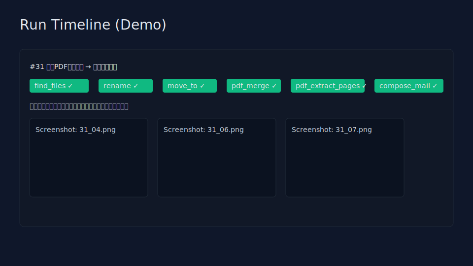
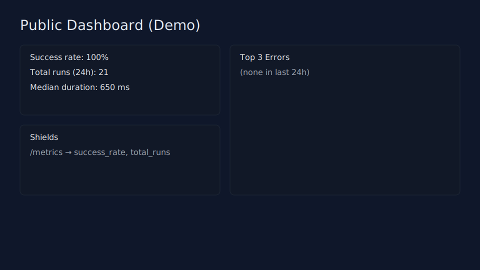

Desktop Agent (Phase 2)

Demo Site: https://axion-inc.github.io/DesktopAgent/


CI: https://github.com/Axion-inc/DesktopAgent/actions
Badges (after deploying /metrics):
- Success rate: ``
- Runs: ``

Purpose: A comprehensive desktop AI agent for macOS 14+ that automates file operations, PDF processing, Mail.app integration, **and web form automation**. Features CLI interface, approval gates for destructive operations, natural language plan generation, and comprehensive testing. Designed for future Windows 11 support with adapter abstractions.

## Phase 2 Features ✨

**Web Automation** - Automate web forms with Playwright
- `open_browser` - Navigate to websites
- `fill_by_label` - Fill form fields by label text
- `click_by_text` - Click buttons and links
- `download_file` - Download files from web pages

**Approval Gates** - Risk analysis for destructive operations
- Automatic detection of high-risk actions (submit, delete, etc.)
- Manual approval workflow for destructive operations
- Risk categorization and detailed analysis

**Planner L1** - Natural language to DSL conversion
- Template-based plan generation from natural language
- Support for CSV-to-form, PDF workflows, and file organization
- Local-only processing, no external API calls

**Enhanced Self-Recovery** - Improved error handling
- Web form field recovery with label synonyms
- Enhanced file operation recovery
- Detailed recovery action logging

**Mock SaaS Testing** - Built-in testing environment
- Japanese mock form for E2E testing
- Realistic form validation and submission
- Perfect for testing web automation workflows

Quickstart (macOS 14+)
- Prereqs: Python 3.11+, Xcode CLT, Node.js (for Playwright), permissions for Screen Recording and Automation.
- Setup:
  - `python3 -m venv venv`
  - `source venv/bin/activate`
  - `pip install -r requirements.txt`
  - `npx playwright install --with-deps chromium` (for web automation)

**CLI Interface**:
  - `./cli.py templates` - List available templates
  - `./cli.py validate plans/templates/weekly_report.yaml` - Validate plan
  - `./cli.py run plans/templates/weekly_report.yaml` - Execute plan
  - `./cli.py list` - View run history
  - `./cli.py show <run_id>` - View run details

**Optional API Server** (for metrics only):
  - `uvicorn app.main:app --reload`
  - Health check: http://127.0.0.1:8000/healthz
  - Metrics: http://127.0.0.1:8000/metrics

Screenshots (Demo)



Notes
- Sample PDFs are self-generated by `scripts/dev_setup_macos.sh` and are license-safe dummy files.
- Set `PERMISSIONS_STRICT=1` to block runs when Screen Recording is not granted (default is warn-only).

Permissions (macOS)
- **Screen Recording**: System Settings → Privacy & Security → Screen Recording → allow Terminal and your Python.
  - Diagram: docs/assets/permissions_screen_recording.svg
- **Automation (Mail, Finder, System Events)**: First run will prompt; or enable under Privacy & Security → Automation.
  - Diagram: docs/assets/permissions_automation.svg
- **Diagnostic UI**: Visit `/permissions` for real-time permission status and step-by-step fix instructions.
- **Blocking Mode**: Set `PERMISSIONS_STRICT=1` to block execution when permissions are missing (default: warning only).

Flow
- Plans → CLI Validation → **Risk Analysis & Approval** → Execute → View Results

Quick Start
- `./cli.py run plans/templates/weekly_report.yaml` - Run the default weekly report plan

## Web Automation (Phase 2)

**Setup Playwright**
```bash
npx playwright install --with-deps chromium
```

**Web DSL Actions**
```yaml
# Open browser and navigate
- open_browser:
    url: "https://example.com/form"
    context: "default"

# Fill form fields by label
- fill_by_label:
    label: "氏名"  # or "Name", "Full Name"
    text: "{{csv_data.name}}"
    context: "default"

# Click buttons or links
- click_by_text:
    text: "送信"  # or "Submit", "Send"
    role: "button"  # optional: button, link
    context: "default"

# Download files
- download_file:
    target_path: "./downloads/"
    context: "default"
```

**Label Recovery** - Automatic fallback strategies:
- Primary: `page.get_by_label()` (most stable)
- Fallback 1: Synonym matching (`氏名` → `名前`, `お名前`, `Name`)
- Fallback 2: Placeholder text matching
- Fallback 3: CSS selector patterns

**Mock SaaS Form** - Test web automation with included templates targeting mock forms for E2E testing

## Approval Gates (Phase 2)

**Risk Analysis** - Automatic detection of destructive operations:
- **High Risk**: `送信`, `確定`, `Submit`, `Delete`, `削除`, `上書き`
- **Medium Risk**: Form submissions, file moves, email composition
- **Low Risk**: Read-only operations, logging

**Approval Workflow**:
1. Plan submitted → Risk analysis
2. If risky → Manual approval required
3. Approval granted → Plan executes
4. All actions logged with approval status

**CLI Approval**: Use `--auto-approve` flag to bypass approval gates, or CLI will prompt when approval is required

## Planner L1 (Phase 2)

**Natural Language to DSL** - Convert intent to executable plans:

**Usage**: Natural language planning is integrated into the CLI workflow and available through the included plan templates

**Supported Workflows**:
- **CSV to Form**: "csvファイルをフォームに転記"
- **PDF Merge**: "Merge PDF files and email result"  
- **File Organization**: "ダウンロードフォルダを整理"

**Templates Generated**:
- CSV processing with web form submission
- PDF operations with email attachment
- File organization with pattern matching

**Features**:
- Local-only processing (no API calls)
- Template-based generation
- Confidence scoring
- Entity extraction (file types, actions, quantities)

Sample PDFs
- 10 dummy PDFs are bundled via generator; run `scripts/dev_setup_macos.sh` to (re)materialize them into `sample_data/` safely (license-free).

Windows Roadmap (stubs included)
- Mail via Outlook `win32com` (compose, attach, save draft)
- Preview alternative via `os.startfile`
- Future: UI Automation (UIA) for richer flows

## Testing (Phase 2)

**Unit Tests**
```bash
pytest tests/ -v -k "not e2e"
```

**E2E Tests** (with Playwright)
```bash
# Start server
uvicorn app.main:app --host 0.0.0.0 --port 8000 &

# Run E2E tests
export BASE_URL="http://localhost:8000"
export PLAYWRIGHT_HEADLESS="true"
pytest tests/ -v -k "e2e" --maxfail=3
```

**Test Coverage**:
- Web actions (mocked and real browser)
- Approval system (risk analysis, workflow)
- Planner L1 (intent matching, DSL generation)
- Mock form automation (Japanese form testing)
- Self-recovery mechanisms
- Dashboard and metrics endpoints

## CI

**GitHub Actions** - Enhanced pipeline:
- **Unit Tests**: flake8 linting + pytest (non-E2E)
- **E2E Tests**: Playwright browser automation (main branch only)
- **Playwright Setup**: Automatic browser installation
- **Parallel Jobs**: Unit and E2E tests run separately for efficiency

## Metrics / Badges (Phase 2)

**Enhanced Metrics** - `/metrics` exposes comprehensive JSON with Phase 2 indicators:
```json
{
  "success_rate_24h": 0.94,
  "median_duration_ms_24h": 18200,
  "p95_duration_ms_24h": 41000,
  "approvals_required_24h": 12,
  "approvals_granted_24h": 10,
  "web_step_success_rate_24h": 0.92,
  "recovery_applied_24h": 5,
  "top_errors_24h": [
    {"cluster": "PDF_PARSE_ERROR", "count": 3},
    {"cluster": "WEB_ELEMENT_NOT_FOUND", "count": 2},
    {"cluster": "APPROVAL_DENIED", "count": 1}
  ],
  "rolling_7d": {"success_rate": 0.93, "median_duration_ms": 19000}
}
```

**Phase 2 Metrics**:
- **Approval Metrics**: Required vs granted approvals (24h)
- **Web Success Rate**: Web automation step success rate (24h)
- **Recovery Applied**: Self-recovery actions triggered (24h)
- **Enhanced Errors**: Web-specific error clustering

**Dashboard** - Metrics available via API endpoint `/metrics` including:
- Traditional success rates and run counts
- Approval workflow statistics
- Web automation performance
- Recovery action frequency

Security & Privacy
- No external LLM/API calls. Public pages mask PII (emails, names, file paths).

Troubleshooting (macOS)

**Permissions Issues**
- **Screen Recording**: Black screenshots or blank captures → System Settings → Privacy & Security → Screen Recording → add Terminal/Python
- **Mail Automation**: "Not authorized" errors → System Settings → Privacy & Security → Automation → Terminal → Mail (enable)
- **Strict Mode**: Set `PERMISSIONS_STRICT=1` to block execution instead of warning

**Common Failures**
- **"No files found"** → Check query syntax and root paths in `find_files` steps
- **PDF errors** → Ensure input files exist and are valid PDFs
- **Path errors** → Use `~/` for home directory expansion, check file existence
- **AppleScript Mail** → Launch Mail.app once manually, then retry

**Self-Recovery Features** (Phase 2 Enhanced)
- **Auto-directory creation**: `move_to` creates missing output folders automatically
- **Search expansion**: `find_files` with 0 results widens search by one level (once)
- **Web field recovery**: Label synonyms and fallback strategies for web forms
- **Replay tracking**: Recovery actions are logged in step diffs for visibility

**Phase 2 Troubleshooting**

**Web Automation Issues**
- **"Browser not found"** → Run `npx playwright install --with-deps chromium`
- **"Element not found"** → Check label text, try synonyms (氏名 vs 名前 vs Name)
- **"Page timeout"** → Increase timeout in DSL or check network connectivity
- **"Context not found"** → Ensure `open_browser` step creates the context first

**Approval Workflow Issues**
- **"Approval required"** → Use `--auto-approve` flag or check plan for destructive keywords (送信, Submit, Delete)
- **"Approval denied"** → Review plan content and use `--auto-approve` if appropriate

**Template Issues**
- **"Template not found"** → Use `./cli.py templates` to list available templates
- **"Plan validation failed"** → Use `./cli.py validate <file>` to check syntax errors

**Logs & Debugging**
- Use `./cli.py show <run_id>` to view detailed run results
- Error details with line numbers in validation failures  
- Screenshots and step outputs stored in data directory

License
- MIT

## CLI Interface (NEW)

**Command Overview**:
```bash
# Template management
./cli.py templates                    # List available templates
./cli.py template <filename>          # Show template content

# Plan validation and execution  
./cli.py validate <file>              # Validate YAML plan
./cli.py run <file>                   # Execute plan
./cli.py run <file> --auto-approve    # Execute with auto-approval

# Run management
./cli.py list                         # List all runs
./cli.py show <run_id>                # Show run details
```

**Examples**:
```bash
# List available templates
./cli.py templates

# Validate a plan
./cli.py validate plans/templates/weekly_report.yaml

# Run a plan (will prompt for approval if needed)
./cli.py run plans/templates/weekly_report.yaml

# Run with auto-approval for high-risk operations
./cli.py run plans/templates/csv_to_form.yaml --auto-approve

# Check run history
./cli.py list
./cli.py show 1
```

**CLI Advantages**:
- **Pure CLI**: No web dependencies, perfect for automation and scripting
- **Headless Operation**: Ideal for server environments and CI/CD
- **Direct Execution**: Immediate feedback without browser overhead

## Legacy CLI Scripts
- Single run of the weekly template in dry-run mode with sample data:
  - `python scripts/run_plan.py plans/templates/weekly_report.yaml --dry-run --var inbox=./sample_data --var workdir=./data/work --var out_pdf=./data/weekly.pdf`
- Seed 20 runs (dry-run) to validate stability:
  - `python scripts/seed_runs.py plans/templates/weekly_report.yaml --dry-run --n 20 --var inbox=./sample_data --var workdir=./data/work --var out_pdf=./data/weekly.pdf`
- Seed 20 runs (REAL) to record in /runs (opens Preview, creates Mail drafts):
  - `python scripts/seed_runs_real.py plans/templates/weekly_report.yaml --n 20 --sleep 1 --var inbox=./sample_data --var workdir=./data/work --var out_pdf=./data/weekly.pdf`
  - Optional: `export PERMISSIONS_STRICT=1` to block if Screen Recording is missing.

Shields.io Badges
- Example (replace URL with your deployment):
  - Success rate: `https://img.shields.io/endpoint?url=https://your.host/metrics&label=success&query=$.success_rate&suffix=%25`
  - Total runs: `https://img.shields.io/endpoint?url=https://your.host/metrics&label=runs&query=$.total_runs`

## DSL v1.1 Features (Phase 2)

**Core Features**:
- **Version Declaration**: Plans must start with `dsl_version: "1.1"`
- **Conditional Execution**: `when:` expressions support step references like `"{{steps[0].found}} > 0"`
- **Step Output Access**: Reference previous step results via `{{steps[i].field}}` (e.g., `{{steps[0].found}}`, `{{steps[3].page_count}}`)
- **Static Validation**: Prevents referencing future steps in `when` conditions (compile-time check)

**Phase 2 Web Actions**:
- **`open_browser`**: Navigate to websites with context management
- **`fill_by_label`**: Fill form fields with intelligent label matching
- **`click_by_text`**: Click buttons/links with role-based targeting
- **`download_file`**: Download files to specified paths

**Enhanced Self-Recovery**: 
- Auto-directory creation (`move_to`) and search expansion (`find_files`)
- Web form field recovery with label synonyms
- All recovery actions logged in step diffs

**Templates** (Phase 2):
- **`csv_to_form.yaml`** - CSV data to web form submission with approval gates
- **`weekly_report.yaml`** - Updated for v1.1 with conditional steps
- **`weekly_report_split.yaml`** - PDF merge → extract → digest workflow  
- **`downloads_tidy.yaml`** - Automated file organization with pattern matching

**Approval Integration**:
- Automatic risk analysis for destructive actions
- Manual approval workflow for high-risk operations
- Risk categorization and detailed logging

Permissions
- CLI will check and warn about missing permissions; approval blocks if Mail Automation is denied (and optionally Screen Recording with `PERMISSIONS_STRICT=1`).
