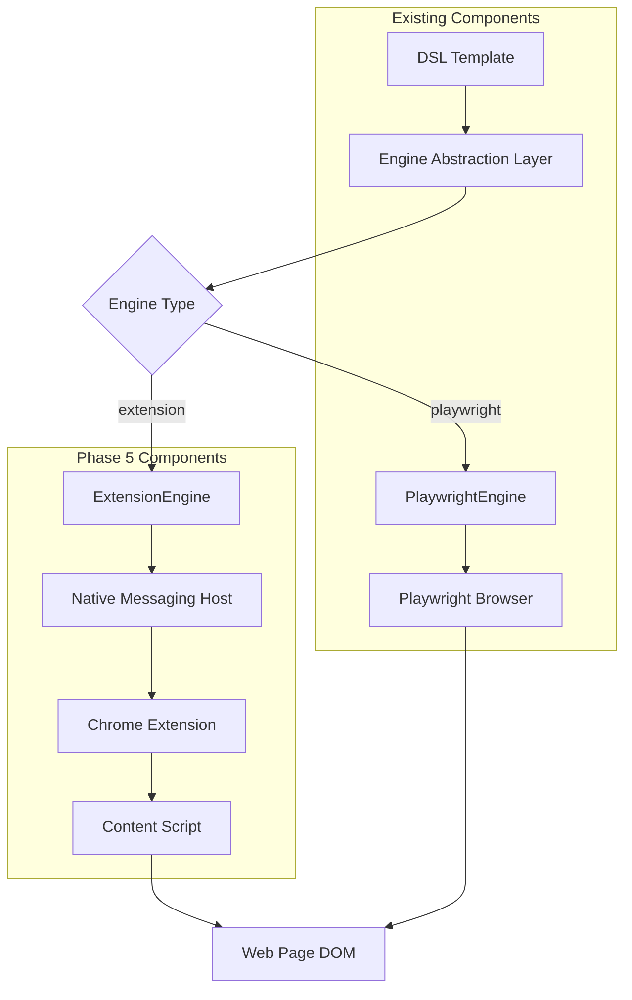

# Phase 5: Web Operator v2 (Chrome Extension + Native Messaging)

## Overview

Phase 5 introduces **Web Operator v2**, a Chrome Extension-based alternative to the existing Playwright web automation engine. This implementation provides a second automation pathway using Chrome's Native Messaging API, enabling more direct browser control and enhanced performance for certain use cases.

## Key Features

### 🔄 **Engine Abstraction**
- **Unified Interface**: All existing Web DSL commands work with both engines
- **Runtime Switching**: Choose engine via `engine: extension|playwright` parameter
- **Backward Compatibility**: Zero breaking changes to existing templates
- **Performance Comparison**: Built-in metrics to compare engine performance

### 🌐 **Chrome Extension (Manifest v3)**
- **Native Messaging**: Direct communication with Desktop Agent via stdio
- **Minimal Permissions**: Only `nativeMessaging`, `activeTab`, and `scripting`
- **Content Script Injection**: DOM manipulation capabilities
- **Background Service Worker**: Persistent connection management

### 🔒 **Security Features**
- **Extension ID Allowlist**: Whitelist specific extension installations
- **Token Handshake**: Secure authentication between extension and host
- **Data Masking**: Sensitive form data never logged or transmitted
- **Minimal Surface**: Reduced attack surface compared to full browser automation

### 📊 **Enhanced Metrics**
- **Engine Usage Distribution**: Track Playwright vs Extension usage
- **Performance Comparison**: Success rates, response times per engine
- **DOM Schema Captures**: Web version of Screen Schema capture
- **Fallback Statistics**: Track engine fallback scenarios

## Architecture



## Installation & Setup

### 1. Install Extension and Native Host

```bash
# Run the automated setup script
./scripts/setup_webx_extension.sh

# Follow the printed instructions for manual Chrome extension installation
```

### 2. Configure Web Engine

Edit `configs/web_engine.yaml`:

```yaml
# Choose default engine
engine: "extension"  # or "playwright"

extension:
  # Replace with actual extension ID after installation
  id: "actual_extension_id_from_chrome"
  
  # Secure handshake token (change for production)
  handshake_token: "your_secure_token_here"
  
  # Communication timeout
  timeout_ms: 15000
  
  security:
    allowed_origins:
      - "http://localhost:*"
      - "https://localhost:*"
    
    # Enable debugger for file uploads (optional)
    enable_debugger: false
```

### 3. Test Installation

```bash
# Run contract tests
python -m pytest tests/contract/test_webx_protocol.py -v

# Run engine abstraction tests
python -m pytest tests/test_web_engine.py -v

# Test both engines with same template
./cli.py run plans/templates/csv_to_form.yaml --var engine=playwright
./cli.py run plans/templates/csv_to_form.yaml --var engine=extension
```

## Usage

### DSL Template Engine Selection

#### Global Configuration
```yaml
# configs/web_engine.yaml
engine: "extension"  # Default for all web actions
```

#### Per-Template Override
```yaml
dsl_version: "1.1"
name: "Extension-based Form Fill"

# Set engine for entire template
execution:
  web_engine: "extension"

steps:
  - open_browser:
      url: "https://example.com/form"
      # engine: extension (inherited from execution)
  
  - fill_by_label:
      label: "Email"
      text: "test@example.com"
      # engine: extension (inherited from execution)
```

#### Per-Step Override
```yaml
dsl_version: "1.1"
name: "Mixed Engine Usage"

steps:
  - open_browser:
      url: "https://example.com"
      engine: "playwright"      # Use Playwright for navigation
      
  - fill_by_label:
      label: "Username"
      text: "{{user}}"
      engine: "extension"       # Use Extension for form filling
      
  - click_by_text:
      text: "Submit"
      engine: "extension"       # Use Extension for click
```

### Supported Web Actions

All existing web actions work with both engines:

#### Navigation
```yaml
- open_browser:
    url: "https://example.com"
    engine: "extension"
    context: "default"
```

#### Form Interaction
```yaml
- fill_by_label:
    label: "Email Address"
    text: "user@example.com"
    engine: "extension"

- click_by_text:
    text: "Submit"
    role: "button"
    engine: "extension"
```

#### File Operations
```yaml
- upload_file:
    path: "~/Documents/resume.pdf"
    label: "Resume Upload"
    engine: "extension"

- download_file:
    to: "~/Downloads/"
    engine: "extension"

- wait_for_download:
    to: "~/Downloads/"
    timeout_ms: 30000
    engine: "extension"
```

#### Advanced Features
```yaml
- wait_for_selector:
    selector: "#submit-button"
    timeout_ms: 10000
    engine: "extension"

# Extension-only: DOM schema capture
- capture_dom_schema:
    engine: "extension"
```

## Engine Comparison

| Feature | Playwright Engine | Extension Engine |
|---------|------------------|------------------|
| **Setup Complexity** | Medium (browser install) | High (extension install) |
| **Performance** | Good | Excellent (native) |
| **Browser Support** | Chromium, Firefox, Safari | Chrome/Edge only |
| **Permissions** | Full browser control | Minimal (tab access) |
| **File Upload** | Full support | Limited (no debugger) |
| **Screenshots** | Full page capture | OS fallback |
| **Debugging** | DevTools integration | Console logging |
| **Headless Mode** | Supported | Not applicable |
| **Network Interception** | Full control | Limited |

## Security Considerations

### Extension ID Allowlist
```yaml
# configs/web_engine.yaml
extension:
  security:
    # Only allow specific extension installations
    allowed_extension_ids:
      - "abcdef1234567890abcdef1234567890"
    
    # Require handshake token
    require_handshake: true
```

### Handshake Authentication
```javascript
// Extension sends handshake on connection
{
  "method": "handshake",
  "params": {
    "extension_id": "actual_extension_id",
    "version": "1.0.0",
    "token": "secure_handshake_token"
  }
}
```

### Data Protection
- **Form Data Masking**: Passwords and sensitive fields automatically masked
- **No Persistent Storage**: No data stored in extension or host
- **Minimal Permissions**: Only necessary Chrome permissions requested
- **Token Validation**: All RPC calls require prior handshake

## Troubleshooting

### Common Issues

#### Extension Not Connecting
```bash
# Check native messaging host
echo '{"method":"handshake","params":{"extension_id":"test"},"id":1}' | webx-native-host

# Check Chrome extension console
# 1. Open Chrome DevTools on extension background page
# 2. Look for "Desktop Agent WebX installed" message
# 3. Check for connection errors
```

#### Native Host Not Found
```bash
# Verify native host installation
ls -la /usr/local/bin/webx-native-host

# Check native messaging manifest
# macOS: ~/Library/Application Support/Google/Chrome/NativeMessagingHosts/
# Linux: ~/.config/google-chrome/NativeMessagingHosts/
cat ~/Library/Application\ Support/Google/Chrome/NativeMessagingHosts/com.desktopagent.webx.json
```

#### Permission Denied
```bash
# Make native host executable
chmod +x /usr/local/bin/webx-native-host

# Verify extension ID in configuration
# Check actual ID in chrome://extensions/ matches configs/web_engine.yaml
```

#### RPC Timeout
```yaml
# Increase timeout in configuration
extension:
  timeout_ms: 30000  # Increase from 15000
```

### Debug Mode
```yaml
# Enable debug logging
extension:
  security:
    log_sensitive_ops: true  # Enable in development only

development:
  log_engine_selection: true
  mock_extension_responses: false  # Set true for testing without extension
```

## Metrics & Monitoring

### Phase 5 Metrics Available

Access metrics via `/metrics` endpoint:

```json
{
  "extension_engine_usage_rate_24h": 0.65,
  "playwright_engine_usage_rate_24h": 0.35,
  "extension_engine_success_rate_24h": 0.94,
  "extension_engine_steps_24h": 157,
  "playwright_engine_steps_24h": 86,
  "dom_schema_captures_24h": 23,
  "native_messaging_calls_24h": 157,
  "engine_fallback_rate_24h": 0.02,
  "extension_connectivity_failures_24h": 1,
  "web_engine_abstraction_enabled": true,
  "total_web_engine_steps_24h": 243
}
```

### Dashboard Integration

The metrics are automatically included in the web dashboard at `/public/dashboard`.

### Performance Analysis
```bash
# Compare engine performance
curl localhost:8000/metrics | jq '{
  extension_success: .extension_engine_success_rate_24h,
  playwright_success: .web_step_success_rate_24h,
  extension_steps: .extension_engine_steps_24h,
  playwright_steps: .playwright_engine_steps_24h
}'
```

## Development & Testing

### Running Tests
```bash
# Contract tests (require native host setup)
python -m pytest tests/contract/test_webx_protocol.py -v

# Unit tests (no extension required)
python -m pytest tests/test_web_engine.py -v

# E2E tests with both engines
python -m pytest tests/ -k "e2e" --engine=both
```

### Mock Mode for Development
```yaml
# configs/web_engine.yaml
development:
  mock_extension_responses: true  # Use mock responses for testing
  force_engine: "extension"       # Force engine selection
```

### Creating New RPC Methods

1. **Add to Native Host** (`app/web/native_host.py`):
```python
def _handle_new_method(self, params):
    # Implementation
    return {"success": True, "result": "data"}

# Register in __init__
self.rpc_handlers['new_method'] = self._handle_new_method
```

2. **Add to Content Script** (`webx-extension/content.js`):
```javascript
async executeRPC(method, params) {
    if (method === 'new_method') {
        return await this.handleNewMethod(params);
    }
    // ...existing methods
}
```

3. **Add to Engine** (`app/web/engine.py`):
```python
def new_method(self, param1, context="default", **kwargs):
    params = {"param1": param1, "context": context, **kwargs}
    return self._send_rpc("new_method", params)
```

## Roadmap

### Current Limitations
- **Chrome Only**: No Firefox/Safari support
- **File Upload**: Limited without debugger permissions
- **Network Control**: No request interception
- **Mobile**: No mobile browser support

### Future Enhancements
- **Firefox Extension**: WebExtensions port
- **Enhanced File Upload**: Debugger API integration
- **Request Interception**: Network monitoring capabilities
- **Mobile Support**: Progressive Web App integration
- **Performance Optimization**: Connection pooling, message batching

## Migration Guide

### From Playwright to Extension

No code changes required! Just update the configuration:

```yaml
# Before
engine: "playwright"

# After  
engine: "extension"
```

### Gradual Migration
```yaml
# Test specific templates with extension engine
dsl_version: "1.1"
name: "Test Extension Engine"
execution:
  web_engine: "extension"  # Override global setting
```

### Performance Testing
```bash
# Run same template with both engines
time ./cli.py run template.yaml --var engine=playwright
time ./cli.py run template.yaml --var engine=extension

# Compare metrics
curl localhost:8000/metrics | jq .extension_engine_success_rate_24h
curl localhost:8000/metrics | jq .web_step_success_rate_24h
```

---

**Phase 5 provides a powerful alternative web automation engine while maintaining complete backward compatibility. The engine abstraction allows seamless switching between Playwright and Extension engines based on your specific needs and constraints.**