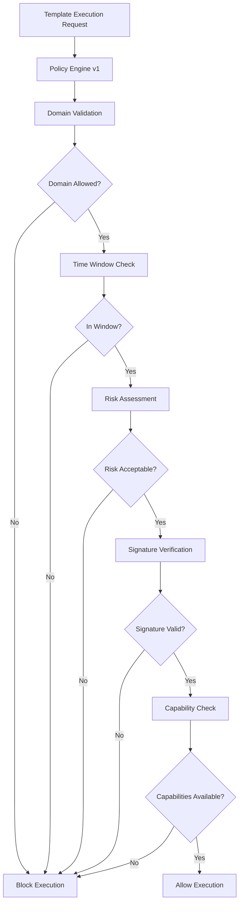

# Policy Engine v1 Documentation

## Overview

The Policy Engine v1 provides comprehensive policy-based execution control for Desktop Agent Phase 7. It implements safe-fail mechanisms with domain validation, time window enforcement, risk assessment, and template signature verification.

## Architecture

```
Policy Engine v1
├── Domain Validation     - Allow/block execution based on permitted domains
├── Time Window Control   - Execute only during configured time windows
├── Risk Assessment      - Classify and control dangerous operations
├── Signature Verification - Require cryptographic signatures
├── Capability Matching  - Ensure required capabilities are available
└── Safe-Fail Blocking   - Policy violations immediately block execution
```

## Configuration

### Basic Policy Configuration (`configs/policy.yaml`)

```yaml
# Desktop Agent Policy Configuration - Phase 7
autopilot: false                  # デフォOFF（L4）
allow_domains: ["partner.example.com"]
allow_risks: ["sends"]            # ここに無いリスクはHITL必須
window: "SUN 00:00-06:00 Asia/Tokyo"
require_signed_templates: true
require_capabilities: ["webx"]

# 差分パッチ採用ポリシー
adopt_policy:
  low_risk_auto: true     # L4窓内かつ低リスクなら自動採用
  min_confidence: 0.85

# 逸脱検知設定
deviation_threshold: 3
step_timeout: 30.0
unexpected_penalty: 2
failed_penalty: 1
risk_penalty: 5
```

### Policy Fields

| Field | Type | Description |
|-------|------|-------------|
| `autopilot` | boolean | Enable/disable L4 autopilot mode |
| `allow_domains` | array | Whitelist of permitted domains |
| `allow_risks` | array | Permitted risk categories (`sends`, `deletes`, `overwrites`) |
| `window` | string | Time window for autopilot execution (cron-like format) |
| `require_signed_templates` | boolean | Require cryptographic template signatures |
| `require_capabilities` | array | Required capabilities for execution |
| `adopt_policy.low_risk_auto` | boolean | Auto-adopt low-risk patches in L4 window |
| `adopt_policy.min_confidence` | float | Minimum confidence threshold for auto-adoption |

## Usage Examples

### Initialize Policy Engine

```python
from app.policy.engine import PolicyEngine, PolicyConfig

# Load configuration
config = PolicyConfig.from_yaml("configs/policy.yaml")

# Initialize policy engine
policy_engine = PolicyEngine(config)
```

### Validate Template Execution

```python
# Check if template execution is allowed
template_manifest = {
    "name": "data-export-template",
    "target_domain": "partner.example.com",
    "risk_flags": ["sends"],
    "required_capabilities": ["webx"],
    "signature_verified": True
}

# Policy validation
validation_result = policy_engine.validate_execution(template_manifest)

if validation_result.allowed:
    print("✅ Execution approved by policy")
    # Proceed with execution
else:
    print(f"❌ Policy violation: {validation_result.reason}")
    # Block execution, require HITL approval
```

### Time Window Validation

```python
from datetime import datetime
import pytz

# Check if current time is within policy window
current_time = datetime.now(pytz.timezone('Asia/Tokyo'))
window_valid = policy_engine.validate_time_window(current_time)

if window_valid:
    print("✅ Execution within allowed time window")
else:
    print("❌ Outside permitted execution window")
```

### Risk Assessment

```python
# Assess template risk level
risk_assessment = policy_engine.assess_risks(template_manifest)

print(f"Risk Level: {risk_assessment.level}")
print(f"Risk Flags: {risk_assessment.flags}")
print(f"Requires HITL: {risk_assessment.requires_hitl}")
```

## Policy Validation Process



## Security Features

### Template Signature Verification

The Policy Engine v1 enforces cryptographic signature verification for templates:

```python
# Check template signature
signature_valid = policy_engine.verify_template_signature(
    template_content=template_yaml,
    signature=signature_data,
    public_key_id="key_2024_01"
)
```

### Domain Whitelisting

Only templates targeting whitelisted domains are permitted:

```python
# Domain validation
allowed_domains = ["partner.example.com", "internal.company.com"]
target_domain = "suspicious.external.com"

if target_domain not in allowed_domains:
    raise PolicyViolation(f"Domain {target_domain} not in whitelist")
```

### Risk-Based Controls

Templates are categorized by risk level:

- **sends**: Data transmission operations
- **deletes**: File/data deletion operations  
- **overwrites**: File/data overwrite operations

```python
# Risk-based control
template_risks = ["sends", "deletes"]
policy_allowed_risks = ["sends"]

blocked_risks = set(template_risks) - set(policy_allowed_risks)
if blocked_risks:
    raise PolicyViolation(f"High-risk operations not permitted: {blocked_risks}")
```

## Safe-Fail Mechanisms

### Automatic Blocking

Policy violations immediately block execution:

```python
class PolicyViolation(Exception):
    """Raised when policy validation fails"""
    pass

def validate_execution(self, manifest):
    violations = []
    
    if not self._validate_domain(manifest.get('target_domain')):
        violations.append("Domain not whitelisted")
    
    if not self._validate_time_window():
        violations.append("Outside execution window")
    
    if violations:
        raise PolicyViolation("; ".join(violations))
```

### Audit Logging

All policy decisions are logged for audit:

```python
def log_policy_decision(self, decision, manifest, reason=None):
    audit_log.info({
        "event": "policy_decision",
        "decision": decision,  # "allow" or "block"
        "template": manifest.get("name"),
        "domain": manifest.get("target_domain"),
        "reason": reason,
        "timestamp": datetime.now(timezone.utc).isoformat()
    })
```

## Metrics and Monitoring

### Key Metrics

- `policy_blocks_24h`: Number of executions blocked by policy
- `templates_verified_24h`: Number of template signatures verified
- `unsigned_blocked_24h`: Number of unsigned templates blocked
- `domain_violations_24h`: Number of domain whitelist violations

### Policy Health Dashboard

```python
def get_policy_metrics():
    return {
        "enforcement_level": "strict",
        "blocks_24h": get_counter('policy_blocks_24h'),
        "verifications_24h": get_counter('templates_verified_24h'),
        "violation_rate": calculate_violation_rate(),
        "top_blocked_domains": get_top_blocked_domains()
    }
```

## Integration with L4 Autopilot

The Policy Engine v1 is tightly integrated with L4 Autopilot:

```python
# L4 Autopilot policy check
def can_enable_autopilot(self, manifest):
    if not self.config.autopilot_enabled:
        return False, "Autopilot disabled by policy"
    
    if not self._validate_all_checks(manifest):
        return False, "Policy validation failed"
    
    if not self._in_autopilot_window():
        return False, "Outside autopilot time window"
    
    return True, "Autopilot approved"
```

## Error Handling

### Policy Violation Handling

```python
try:
    policy_engine.validate_execution(template_manifest)
    # Execute template
except PolicyViolation as e:
    # Log violation
    logger.warning(f"Policy violation: {e}")
    
    # Send notification
    await notification_manager.send_policy_violation_alert(
        violation_type=e.violation_type,
        template_name=template_manifest.get("name"),
        policy_details={"reason": str(e)}
    )
    
    # Escalate to HITL
    return {"status": "blocked", "reason": str(e), "requires_approval": True}
```

## Best Practices

### 1. Gradual Policy Rollout

Start with permissive policies and gradually restrict:

```yaml
# Phase 1: Monitor only
autopilot: false
allow_domains: ["*"]  # Monitor all domains
log_only: true        # Don't block, just log

# Phase 2: Domain restriction
allow_domains: ["trusted.example.com", "partner.example.com"]
log_only: false       # Start blocking

# Phase 3: Time window restriction
window: "MON-FRI 09:00-17:00 Asia/Tokyo"

# Phase 4: Risk restriction
allow_risks: ["sends"]  # Block deletes and overwrites
```

### 2. Regular Policy Review

Review policy effectiveness regularly:

```python
def generate_policy_report():
    return {
        "blocks_by_reason": get_blocks_by_reason(),
        "top_blocked_templates": get_top_blocked_templates(),
        "violation_trends": get_violation_trends(),
        "recommendations": generate_policy_recommendations()
    }
```

### 3. Emergency Policy Override

Implement emergency override for critical situations:

```python
def emergency_override(self, override_key, reason):
    if not verify_emergency_key(override_key):
        raise SecurityError("Invalid emergency override key")
    
    # Log emergency override
    audit_log.critical({
        "event": "emergency_override",
        "reason": reason,
        "timestamp": datetime.now().isoformat()
    })
    
    # Temporarily disable policy enforcement
    self.emergency_mode = True
    self.emergency_expires = datetime.now() + timedelta(hours=1)
```

## Troubleshooting

### Common Policy Issues

1. **Template Execution Blocked**
   - Check domain whitelist
   - Verify time window
   - Confirm template signature
   - Review risk flags

2. **Autopilot Not Activating**  
   - Ensure `autopilot: true` in policy
   - Check time window configuration
   - Verify all policy validations pass

3. **Signature Verification Failures**
   - Confirm template is signed
   - Check public key availability
   - Verify signature format

### Debug Mode

Enable debug logging for detailed policy evaluation:

```yaml
# In policy.yaml
debug: true
log_level: "DEBUG"
```

```python
# In code
policy_engine.set_debug_mode(True)
result = policy_engine.validate_execution(manifest)
print(policy_engine.get_debug_log())
```

## API Reference

### PolicyEngine Class

```python
class PolicyEngine:
    def __init__(self, config: PolicyConfig)
    def validate_execution(self, manifest: Dict) -> ValidationResult
    def validate_domain(self, domain: str) -> bool
    def validate_time_window(self, timestamp: datetime = None) -> bool
    def assess_risks(self, manifest: Dict) -> RiskAssessment
    def verify_signature(self, template: str, signature: str) -> bool
    def get_policy_status(self) -> Dict[str, Any]
    def get_security_metrics(self) -> Dict[str, Any]
```

### Configuration Classes

```python
@dataclass
class PolicyConfig:
    autopilot_enabled: bool
    allowed_domains: List[str]
    allowed_risks: List[str]
    execution_window: str
    require_signed_templates: bool
    required_capabilities: List[str]
    
    @classmethod
    def from_yaml(cls, path: str) -> 'PolicyConfig'
```

---

*Policy Engine v1 provides enterprise-grade security controls while maintaining the flexibility needed for automation workflows.*